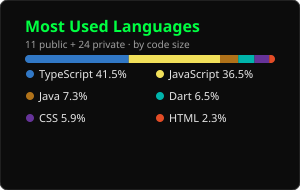

<table border="0" cellspacing="0" cellpadding="16">
<tr>
<td valign="middle" align="center">

</td>
<td valign="middle" align="left">

</td>
</tr>
</table>

  <a href="https://forjasoftware.com.br">forjasoftware.com.br</a>
  ·
  <a href="https://www.instagram.com/forja_software">Instagram</a>

---

 

 

<picture>
  <source media="(prefers-color-scheme: dark)" srcset="https://raw.githubusercontent.com/jhonzito66/jhonzito66/output/github-contribution-grid-snake-dark.svg"/>
  <source media="(prefers-color-scheme: light)" srcset="https://raw.githubusercontent.com/jhonzito66/jhonzito66/output/github-contribution-grid-snake.svg"/>
  
</picture>

